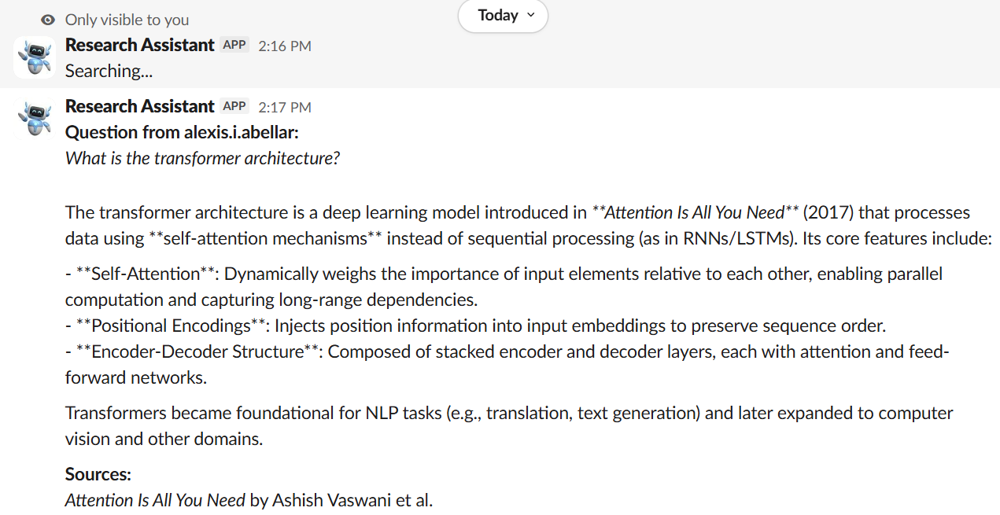
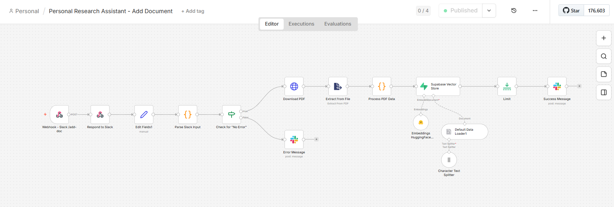
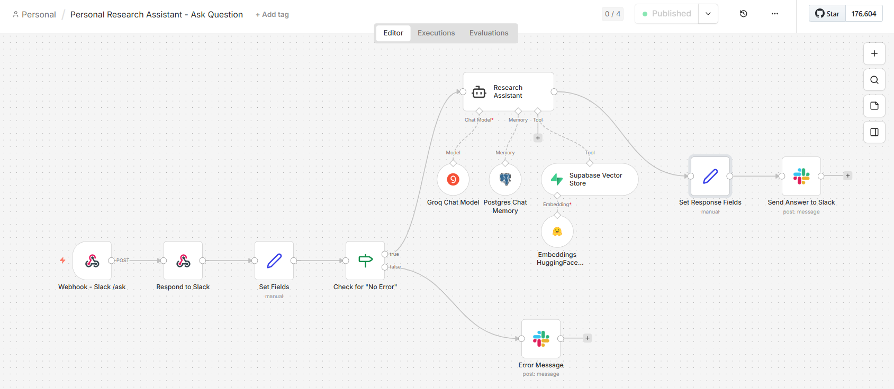

# Personal Research Assistant 🔍

AI-powered research assistant that helps you manage and query PDF documents using **RAG (Retrieval-Augmented Generation)**, vector search, natural language processing, and self-hosted n8n.


## ✨ Features

- 📄 **PDF Document Ingestion** - Add documents via Slack slash command
- 🔍 **Semantic Search** - Find relevant information using vector similarity
- 🤖 **RAG-Powered Q&A** - Ask natural language questions, get cited answers
- 💬 **Conversational Interface** - Follow-up questions with conversation memory
- ⚡ **Real-time Processing** - Responses in 10-15 seconds
- 📊 **Production Ready** - Error handling, retries, logging

## 🎯 Use Case

As a researcher, I needed to quickly find information across dozens of PDFs without re-reading everything. This tool:

- Stores documents in a searchable vector database
- Answers questions using AI with source citations
- Remembers conversation context for follow-ups
- Works entirely through Slack (no new interface to learn)

**Example interaction:**

```
You: /add-doc https://arxiv.org/pdf/1706.03762.pdf
Bot: ✅ Document added successfully!
     You can now query this document using `/ask [your question]`

You: /ask What is the transformer architecture?
Bot: The transformer architecture is a neural network model that relies
     entirely on self-attention mechanisms, eliminating the need for
     recurrence and convolutions (Document 1, 94% match)...

     Sources:
     - "Attention Is All You Need" by Vaswani et al.
```

## 🏗️ Architecture

```
┌─────────┐      ┌──────┐      ┌─────────────┐      ┌──────────┐
│  Slack  │────▶│ n8n   │────▶│   Supabase  │◀───▶│  OpenAI  │
│Commands │      │Workflows    │             │      │  API     │
└─────────┘      └──────┘      └─────────────┘      └──────────┘
                      │                                    │
                      ▼                                    ▼
                ┌───────────┐                        ┌──────────┐
                │ PDF Parser│                        │Embeddings│
                └───────────┘                        └──────────┘
```

**Flow:**

1. User uploads PDF via `/add-doc` command
2. n8n downloads and extracts text
3. AI Model generates vector embedding (dimension depends on model used)
4. Stored in Supabase
5. User asks question via `/ask` command
6. Question is embedded and searched in vector DB
7. Top 3 similar documents retrieved
8. AI Model generates answer with citations
9. Response sent back to Slack

## 🚀 Quick Start

### Prerequisites

- OpenAI API account
- Supabase account (free tier works)
- n8n instance (cloud or self-hosted)
- Slack workspace

### Setup (20 minutes)

**1. Clone this repo:**

```bash
git clone https://github.com/YOUR-USERNAME/personal-research-assistant.git
cd personal-research-assistant
```

**2. Set up Supabase database:**

```bash
# Run the SQL schema in Supabase SQL Editor
cat database/supabase_schema.sql
# Copy and paste into https://app.supabase.com (SQL Editor)
```

**3. Import n8n workflows:**

- Open your n8n instance
- Import `workflows/add-document-workflow.json`
- Import `workflows/ask-question-workflow.json`
- Add your OpenAI and Supabase credentials

**4. Configure Slack app:**

- Create Slack app at api.slack.com/apps
- Add slash commands `/add-doc` and `/ask`
- Point to your n8n webhook URLs
- Install to workspace

**Full setup instructions:** [docs/SETUP_GUIDE.md](docs/SETUP_GUIDE.md)

## 📖 Documentation

- **[Setup Guide](docs/SETUP_GUIDE.md)** - Complete deployment walkthrough
- **[Technical Overview](docs/TECHNICAL_OVERVIEW.md)** - Architecture deep dive
- **[Demo Video](#)** - See it in action (coming soon)

## 💻 Tech Stack

| Component          | Technology                       | Purpose             |
| ------------------ | -------------------------------- | ------------------- |
| **Orchestration**  | n8n                              | Workflow automation |
| **Vector DB**      | Supabase (PostgreSQL + pgvector) | Similarity search   |
| **Embeddings**     | Sentence-Transformer/Distilbert  | 1536-dim vectors    |
| **LLM**            | Groq Qwen-3-32b                  | Question answering  |
| **PDF Processing** | n8n PDF extractor node           | Text extraction     |
| **Interface**      | Slack                            | User commands       |

Note: You can also use OpenAI or other AI Model. Just make sure to change the dimension to 1536 (if OpenAI) or others (depends on the model used). The models used here are for free demonstration purpose only.

## 🔒 Security

- All API keys stored in n8n encrypted credentials
- Documents stored in your own Supabase instance
- No data sharing beyond API calls
- Can be deployed fully self-hosted

## 🛣️ Roadmap

- [✓] PDF document ingestion
- [✓] Document chunking for long files
- [✓] Vector similarity search
- [✓] RAG-powered Q&A
- [✓] Conversation memory
- [ ] Support for DOCX, HTML, Markdown
- [ ] Web interface (beyond Slack)
- [ ] Citation graph visualization

## 🤝 Contributing

This is a personal portfolio project meant to demonstrate my skill, but suggestions are welcome!

## 📝 License

MIT License - feel free to use for your own projects

## 👤 Author

**Alexis Michelle Abellar**

- Portfolio: [lxsmchll.github.io](https://lxsmchll.github.io)
- Email: alexis.i.abellar@gmail.com
- LinkedIn: [linkedin.com/in/alexis-michelle-abellar/](https://www.linkedin.com/in/alexis-michelle-abellar/)

## 🙏 Acknowledgments

Built as a practical application of my skills on:

- AI Model RAG architecture patterns
- Supabase documentation
- n8n community workflows

---

**⭐ If you find this useful, please star the repo!**

---

## 📸 Screenshots

### Adding a Document


### Asking a Question



### n8n Workflow





---

**Built with ❤️ using n8n and Supabase**
